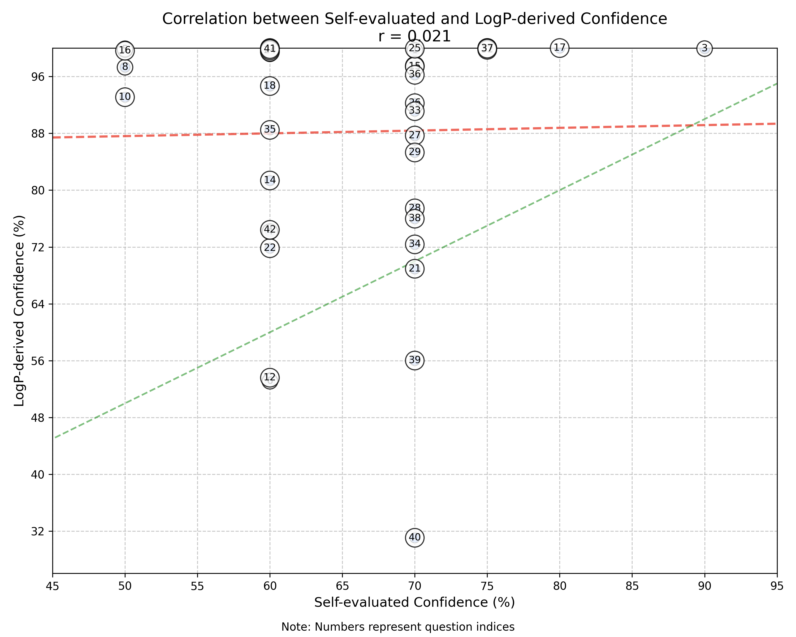

## LLM Self-Evaluated Confidence Experiment

A simple experiment to understand the correlations between an LLM's self-evaluated confidence for a given answer, and the actual probability that it would give that answer (derived from the LogP of a yes/no token).

While hardly comprehensive, the results suggest that LLMs do not typically do a good job of reporting their actual confidence. In most cases they seem to "play it safe" and vastly underestimate their own confidence.

The purpose of this experiment is to better understand whether or not logP could be used as a useful metric for mission-critical answers - if a model is not confident in a particular decision during a high-stakes process perhaps we could detect this and intervene.

Curiosity driven by problems encountered while building [Magnitude](https://magnitude.run).

The questions used are are subjective yes/no questions in [questions.txt](questions.txt).

### Difference Between Self-Evaluated / LogP-Derived Confidence

### Correlation Between Self-Evaluated / LogP-Derived Confidence

### Self-Evaluated / LogP-Derived Confidence Scores

